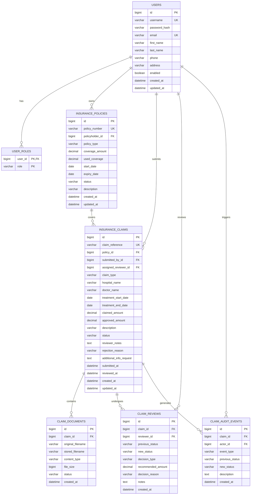

# 10. Entity Relationship (ER) Diagram

The HealthSure relational schema is managed using Flyway migrations (`V1__init_schema.sql` and `V2__seed_data.sql`).

```mermaid
erDiagram
    USERS ||--o{ USER_ROLES : has
    USERS ||--o{ INSURANCE_POLICIES : owns
    USERS ||--o{ INSURANCE_CLAIMS : submits
    USERS ||--o{ CLAIM_REVIEWS : reviews
    USERS ||--o{ CLAIM_AUDIT_EVENTS : triggers

    INSURANCE_POLICIES ||--o{ INSURANCE_CLAIMS : covers
    INSURANCE_CLAIMS ||--o{ CLAIM_DOCUMENTS : contains
    INSURANCE_CLAIMS ||--o{ CLAIM_REVIEWS : undergoes
    INSURANCE_CLAIMS ||--o{ CLAIM_AUDIT_EVENTS : generates

    USERS {
        bigint id PK
        varchar username UK
        varchar password_hash
        varchar email UK
        varchar first_name
        varchar last_name
        varchar phone
        varchar address
        boolean enabled
        datetime created_at
        datetime updated_at
    }

    USER_ROLES {
        bigint user_id PK,FK
        varchar role PK
    }

    INSURANCE_POLICIES {
        bigint id PK
        varchar policy_number UK
        bigint policyholder_id FK
        varchar policy_type
        decimal coverage_amount
        decimal used_coverage
        date start_date
        date expiry_date
        varchar status
        varchar description
        datetime created_at
        datetime updated_at
    }

    INSURANCE_CLAIMS {
        bigint id PK
        varchar claim_reference UK
        bigint policy_id FK
        bigint submitted_by_id FK
        bigint assigned_reviewer_id FK
        varchar claim_type
        varchar hospital_name
        varchar doctor_name
        date treatment_start_date
        date treatment_end_date
        decimal claimed_amount
        decimal approved_amount
        varchar description
        varchar status
        text reviewer_notes
        varchar rejection_reason
        text additional_info_request
        datetime submitted_at
        datetime reviewed_at
        datetime created_at
        datetime updated_at
    }

    CLAIM_DOCUMENTS {
        bigint id PK
        bigint claim_id FK
        varchar original_filename
        varchar stored_filename
        varchar content_type
        bigint file_size
        varchar status
        datetime created_at
    }

    CLAIM_REVIEWS {
        bigint id PK
        bigint claim_id FK
        bigint reviewer_id FK
        varchar previous_status
        varchar new_status
        varchar decision_type
        decimal recommended_amount
        varchar decision_reason
        text notes
        datetime created_at
    }

    CLAIM_AUDIT_EVENTS {
        bigint id PK
        bigint claim_id FK
        bigint actor_id FK
        varchar event_type
        varchar previous_status
        varchar new_status
        text description
        datetime created_at
    }
```
